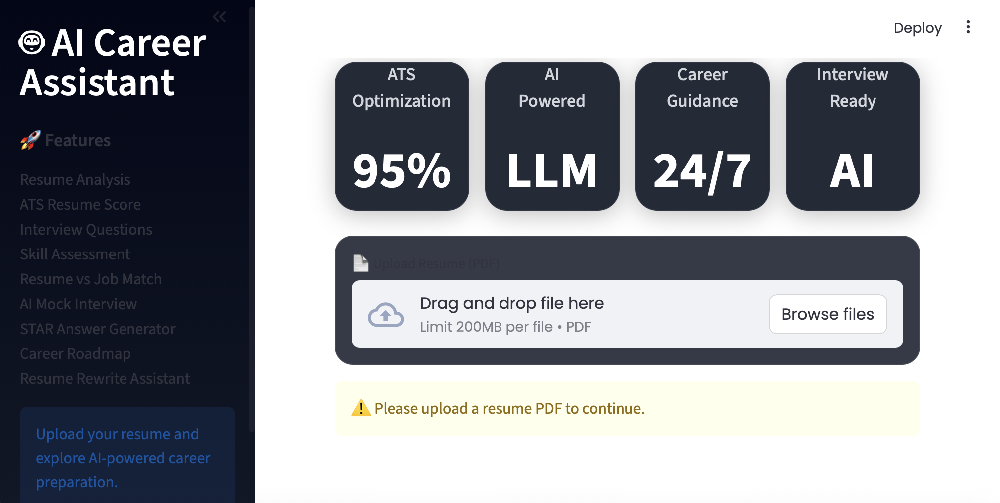
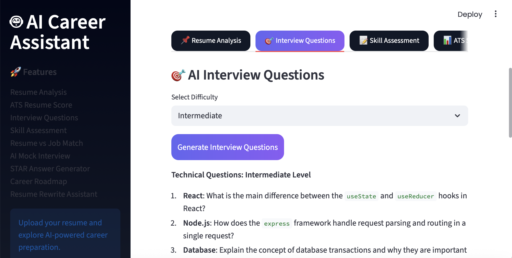
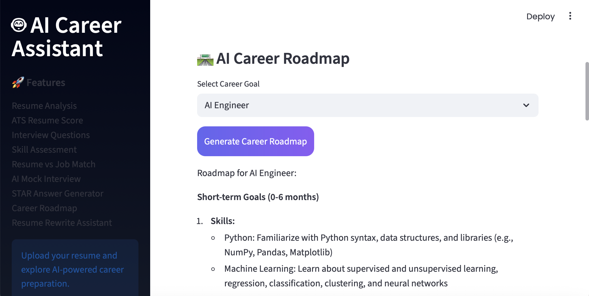
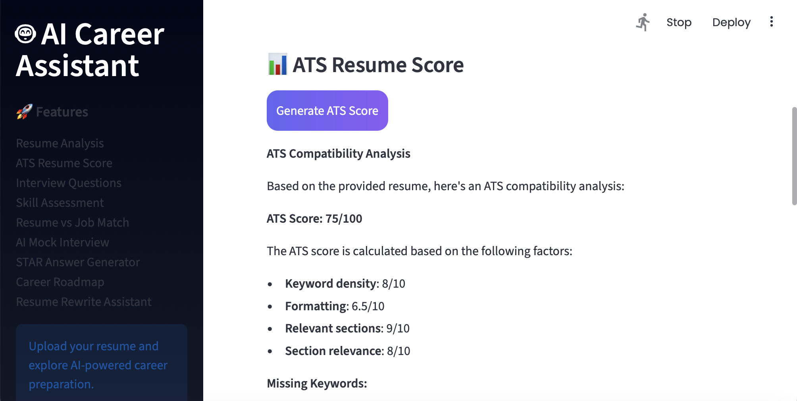
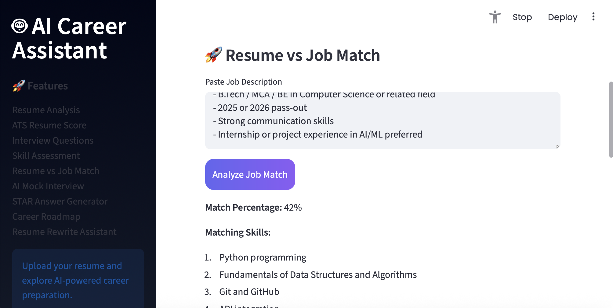
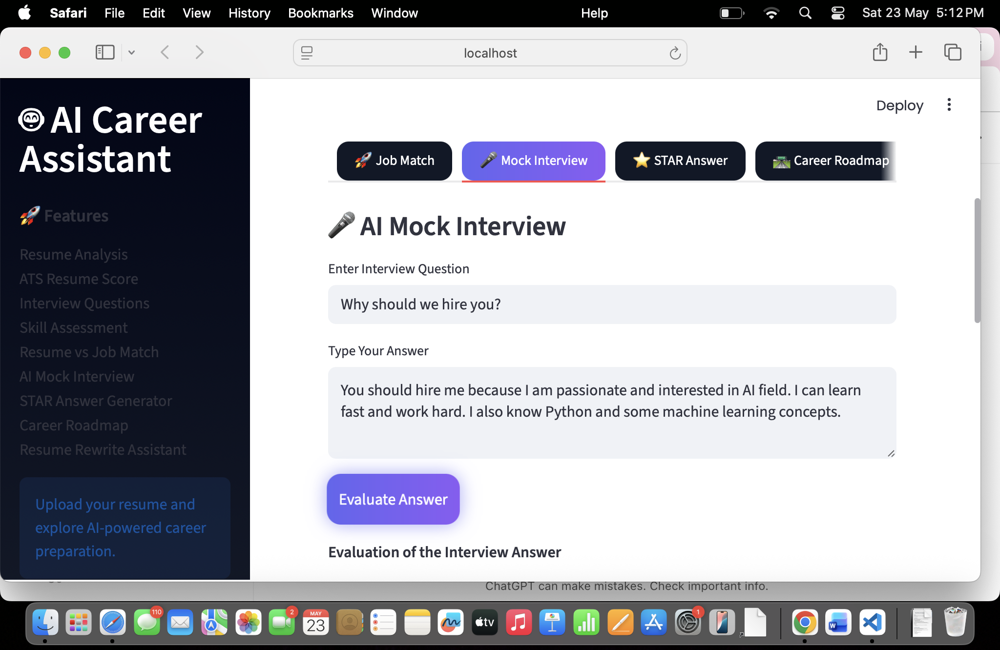
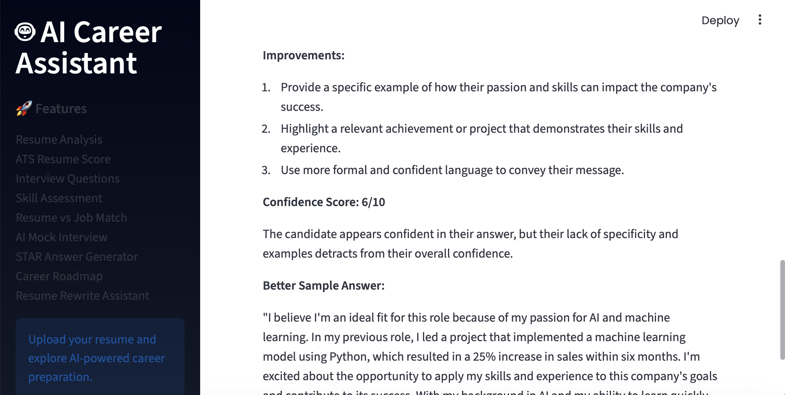
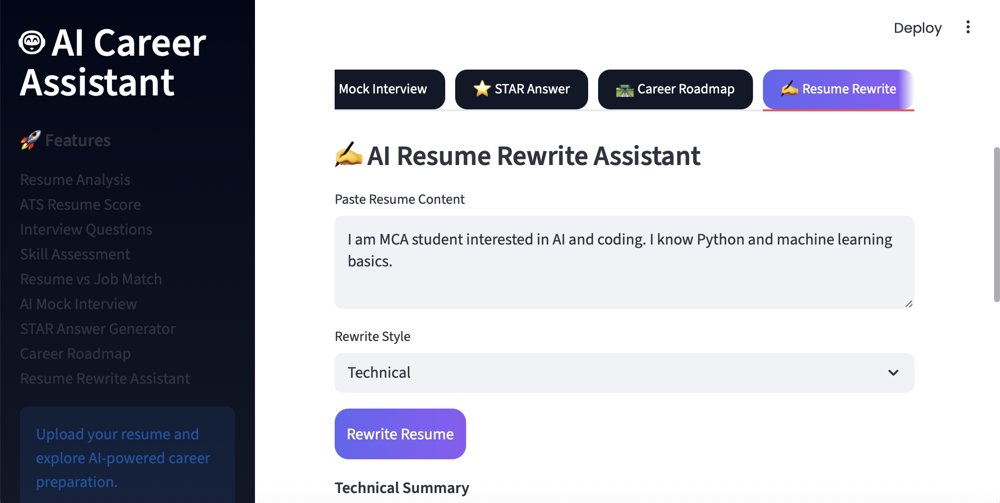
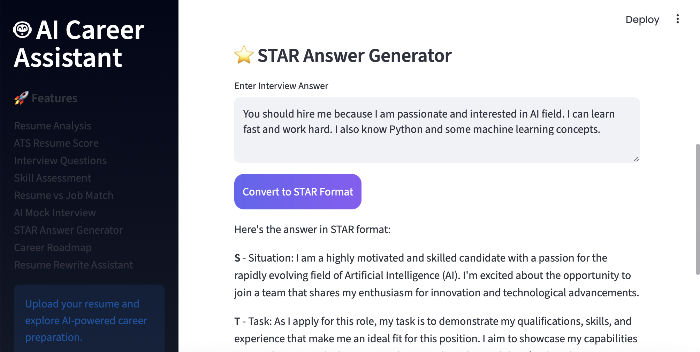

# 🤖 AI-Powered Interview & Resume Assistant

An AI-powered career intelligence platform built using Streamlit, Groq LLM API, and Python.

This application helps users analyze resumes, prepare for interviews, optimize ATS scores, generate career roadmaps, and improve resume quality using Generative AI.

---

# 🚀 Features

## 📌 Resume Analysis
- Professional summary generation
- Strengths and weaknesses detection
- Skill extraction
- Suggested job roles

## 📊 ATS Resume Score
- ATS compatibility analysis
- Missing keyword suggestions
- Resume improvement tips

## 🎯 AI Interview Questions
- Technical interview questions
- HR interview questions
- Project-based interview questions
- Difficulty selection

## 📝 Skill Assessment
- Technical MCQs
- Aptitude questions
- Logical reasoning questions

## 🚀 Resume vs Job Match
- Match percentage calculation
- Missing skills detection
- Resume optimization suggestions

## 🎤 AI Mock Interview
- Interview answer evaluation
- Strengths and weaknesses analysis
- Confidence scoring
- Improved sample answers

## ⭐ STAR Answer Generator
Converts interview answers into:
- Situation
- Task
- Action
- Result

format for professional interview responses.

## 🛣️ AI Career Roadmap
Generates personalized:
- Learning roadmap
- Skills to learn
- Certifications
- Project ideas
- Career preparation plan

## ✍️ AI Resume Rewrite Assistant
- ATS-friendly resume rewriting
- Professional content enhancement
- Technical rewrite support
- Recruiter-friendly formatting

---

# 🛠️ Tech Stack

- Python
- Streamlit
- Groq API
- LLM (Llama 3.1)
- PyPDF2

---

# 📂 Project Structure

```bash
AI-Powered-Interview-Assistant/
│
├── app.py
├── requirements.txt
├── README.md
```
---

# ⚙️ Installation

# 1️⃣ Clone Repository:
git clone https://github.com/your-username/AI-Powered-Interview-Assistant.git

# 2️⃣ Navigate to Project Folder:
cd AI-Powered-Interview-Assistant

# 3️⃣ Install Dependencies:
pip install -r requirements.txt

# 4️⃣ Run Application:
streamlit run app.py

---

# 🔑 Environment Setup
Replace the API key in app.py:
api_key="GROQ_API_KEY"
with Groq API key.

---
---

# ⚡ How It Works

1. User uploads resume PDF
2. Resume text is extracted using PyPDF2
3. Prompt engineering is applied
4. Resume data is sent to Groq LLM
5. AI generates analysis, interview questions, ATS score, and recommendations
6. Results are displayed through Streamlit dashboard

---

# 🌟 Key Highlights

- Modern AI dashboard UI
- LLM-powered resume intelligence
- Real-time interview preparation
- ATS resume optimization
- Personalized career roadmap generation
- GenAI-powered content rewriting

---

#🧠 System Architecture:
```text
Resume PDF
   ↓
PyPDF2 Text Extraction
   ↓
Prompt Engineering
   ↓
Groq LLM API
   ↓
AI Response Generation
   ↓
Streamlit Dashboard
```


---

#🎯 Future Improvements:
-PDF report download
-Voice-based mock interview
-AI chatbot support
-Multi-language support
-Resume template generation

# 📸 Screenshots

## Dashboard


## AI Interview Questions


## AI Career Roadmap


## ATS Score


## Resume vs Job Match




## Resume Analysis


## Resume Rewriter


## STAR Answer Generator


## 🌐 Live Demo

🔗 https://ai-powered-interview-assistant-djdvuu2fsrgwtslrbjt8qh.streamlit.app/
